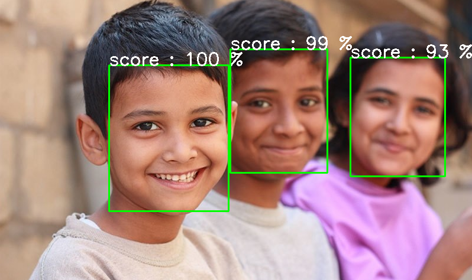

# 🎯 Face Detection using OpenCV DNN

This project uses OpenCV's Deep Neural Network (DNN) module to perform face detection using a pre-trained Caffe model. It detects human faces in images and draws bounding boxes with confidence scores.

---

## 📂 Project Structure

- `face_detection.py` – Python script that loads a pre-trained model, detects faces, and saves the output.
- `faces.jpg` – Sample input image for face detection.
- `output.png` – Output image with detected face(s) and labels.

---

## 🖼️ Example Output

## 📥 Required Files

Before running the code, make sure you have the following model files:

1. **Model architecture file**  
   [`deploy.prototxt.txt`](https://github.com/opencv/opencv/blob/master/samples/dnn/face_detector/deploy.prototxt)

2. **Pre-trained weights**  
   [`res10_300x300_ssd_iter_140000.caffemodel`](https://github.com/opencv/opencv_3rdparty/blob/dnn_samples_face_detector_20170830/res10_300x300_ssd_iter_140000.caffemodel)

You can download them and place them in the same folder as your script, or update the file paths in `face_detection.py` accordingly.

---

## 🧠 How It Works

- The model is based on a Single Shot Detector (SSD) with a ResNet-10 backbone.
- The input image is converted into a **blob** and passed through the DNN.
- The model returns a set of detections with confidence scores.
- Detections with confidence > 50% are drawn on the image using rectangles and labels.

---

## 🔧 Requirements

- Python 3.x
- OpenCV 4.x

---

# 🚗 Car Detection using OpenCV 

This project uses cascades to detect cars in a sample video. 

---

## 🎥 Demo

Here's a sample usage:

